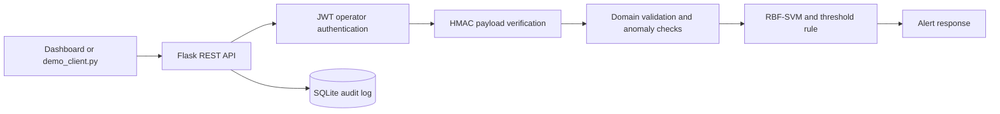

# Secure Real-Time Traffic Congestion Demo

An intentionally small, locally runnable demonstration of the project described
in the ITS presentation: sensor readings are signed, operator requests are
authenticated, traffic congestion is classified with an RBF-kernel SVM, and
every accepted or rejected event is written to an audit log.

This repository is designed for a classroom presentation or project review. It
uses deterministic synthetic data so that the demonstration is repeatable and
does not pretend to make real traffic-control decisions.

## What the demo proves

The demo focuses on one complete vertical slice rather than a large collection
of unfinished features:

1. A simulated sensor produces a reading for a road segment.
2. The API verifies the operator's JWT and the sensor payload's HMAC-SHA256 signature.
3. Domain validation rejects malformed or internally inconsistent readings.
4. A trained RBF-SVM and a transparent `estimated_drho > 70` rule classify the reading.
5. The API returns a recommended action and records the outcome in SQLite.
6. A browser Dashboard makes the accepted and rejected paths visible.

## Architecture



The browser never receives the HMAC secret. For the interactive scenarios, the
server provides pre-signed example payloads and the browser submits them as a
sensor client would. The tampered scenario changes a field after signing, so it
is rejected by the real API trust boundary.

## Requirements

- Python 3.10 or newer
- A modern browser
- No database server, cloud account, or external sensor is required

## Quick start

From this directory:

```bash
python3 -m venv .venv
source .venv/bin/activate
python -m pip install -r requirements.txt
python app.py
```

Open <http://127.0.0.1:5000>.

The default local credentials are:

```text
Username: operator
Password: demo-password
```

The Dashboard fills these values automatically for convenience and also has a
sign-in form. To use different values, export the environment variables before
starting the server, then enter them in the form:

```bash
export DEMO_USERNAME=operator
export DEMO_PASSWORD='choose-a-local-password'
export JWT_SECRET='a-long-random-jwt-secret'
export HMAC_SECRET='a-long-random-sensor-secret'
python app.py
```

## Presentation walkthrough

The Dashboard contains four scenario buttons:

| Scenario | Expected result | What it demonstrates |
| --- | --- | --- |
| Safe reading | `200 OK`, status `safe` | A valid reading below the threshold |
| Congested reading | `200 OK`, status `congested` | A valid alert and recommended reroute |
| Tampered payload | `403`, `invalid_signature` | HMAC detects a field changed after signing |
| Signed anomaly | `422`, `invalid_reading` | A validly signed but impossible reading is rejected |

Recommended live sequence:

1. Start the server and open the Dashboard.
2. Click **Safe reading** and point out the model/rule agreement.
3. Click **Congested reading** and point out the recommended action.
4. Click **Tampered payload** and show that it never reaches classification.
5. Click **Signed anomaly** and explain the difference between authenticity and data quality.
6. Use the Audit Log to show both accepted and rejected events.

The command-line simulator runs the same four scenarios without the browser:

```bash
python demo_client.py
```

## API reference

### `GET /health`

Returns service status, the congestion threshold, and the model metrics used by
the Dashboard.

### `POST /auth/login`

Request:

```json
{
  "username": "operator",
  "password": "demo-password"
}
```

Response:

```json
{
  "access_token": "<short-lived JWT>",
  "token_type": "Bearer"
}
```

### `POST /api/v1/traffic/evaluate`

Requires `Authorization: Bearer <token>`.

Example payload:

```json
{
  "road_id": "GB",
  "distance_km": 0.5,
  "rho_current": 80,
  "rho_previous": 5,
  "alpha": 0.8,
  "estimated_drho": 75,
  "device_id": "sensor-demo-01",
  "timestamp": "2026-07-17T12:00:00Z",
  "signature": "<HMAC-SHA256 digest>"
}
```

Successful responses include:

```json
{
  "road_id": "GB",
  "status": "congested",
  "svm_status": "congested",
  "rule_status": "congested",
  "models_agree": true,
  "confidence": 0.999,
  "threshold": 70.0,
  "recommended_action": "Dynamic message signs + reroute"
}
```

### `POST /api/v1/traffic/batch`

Requires the same bearer token and accepts a JSON object containing a `readings`
array. A batch is capped at 50 records for the demonstration.

### `GET /api/v1/traffic/history`

Requires the bearer token. Returns the newest audit events for the Dashboard.

### `GET /api/v1/demo/scenarios`

Requires the bearer token. Returns the pre-signed example payloads used by the
Dashboard and `demo_client.py`.

## Security design

### Operator authentication

- `/auth/login` compares the configured username and password using a constant-time comparison.
- Successful login returns an HS256 JWT with a short expiration.
- Protected endpoints require an `Authorization: Bearer ...` header.

### Sensor integrity

The HMAC signature is computed over canonical JSON: keys are sorted, whitespace
is removed, and the `signature` field is excluded before signing. This prevents
JSON formatting differences from changing the digest. The API uses
`hmac.compare_digest` to compare the supplied and expected values.

### Domain validation

After the signature is accepted, the API checks required fields, identifier
formats, numeric ranges, timestamp format, and this synthetic demo invariant:

```text
estimated_drho ≈ rho_current - rho_previous
```

The five-unit tolerance represents rounding in a toy sensor feed. It is a demo
rule and should be replaced by a domain-approved data-quality contract in a
real system.

### Rate limiting and auditability

Protected endpoints use an in-memory per-client request limit. Every login,
authentication failure, signature failure, validation failure, and successful
classification is recorded in `traffic_demo.sqlite3`.

## Model and data

The model follows the presentation's methodology:

- 30 deterministic synthetic records
- 20 safe records and 10 congested records
- Features: `distance_km`, `rho_current`, `rho_previous`, `alpha`, and `estimated_drho`
- StandardScaler followed by an RBF-kernel SVM
- A rule-based baseline using `estimated_drho > 70`
- A small held-out test split and five-fold cross-validation

The Dashboard shows the resulting metrics, but they must not be interpreted as
production evidence. The data set is intentionally small and separable. Real
deployment would require a larger, representative, time-aware data set and an
independent evaluation plan.

## Project structure

```text
traffic-congestion-demo/
├── app.py                 # Flask routes, validation, auth, rate limiting
├── model.py               # RBF-SVM, rule baseline, metrics
├── security.py            # Canonical JSON, HMAC, JWT helpers
├── storage.py             # SQLite audit log
├── sample_data.py         # Synthetic training data and demo scenarios
├── demo_client.py         # Standard-library sensor simulator
├── requirements.txt       # Runtime dependencies
├── .env.example           # Local configuration reference
├── templates/index.html   # Dashboard markup
├── static/app.js          # Dashboard behaviour
├── static/styles.css      # Dashboard styling
└── tests/test_app.py      # HTTP-level trust-boundary tests
```

## Tests

Run the focused integration tests from the project directory:

```bash
python -m unittest discover -s tests -v
```

The tests cover health/model initialisation, successful classification, HMAC
tampering rejection, signed anomaly rejection, and audit-log visibility.

## Deploy on Render

This project includes a `render.yaml` Blueprint and a pinned Python version.
The shortest deployment path is:

1. Push the contents of this directory to a GitHub repository.
2. In Render, choose **New → Blueprint** and connect that repository.
3. Confirm the `traffic-congestion-demo` web service and choose the Free plan.
4. When prompted for `DEMO_PASSWORD`, enter a demo-only password.
5. Let Render generate `JWT_SECRET` and `HMAC_SECRET` from the Blueprint.
6. Open the public `.onrender.com` URL after the health check passes.

If the whole Yoobee workspace is pushed as one repository, set Render's
**Root Directory** to `traffic-congestion-demo` instead. Render's native Flask
deployment flow uses `pip install -r requirements.txt` and Gunicorn; this
project already contains both the dependency and the start command.

The free service is suitable for a presentation or review link, not production:
it can sleep after inactivity, and its local filesystem is ephemeral. The
SQLite audit log may reset after a restart or redeploy. For a durable version,
replace SQLite with a managed database and move secrets into Render's managed
environment variables.

Official references: [Render Flask deployment](https://render.com/docs/deploy-flask),
[Render Blueprint specification](https://render.com/docs/blueprint-spec), and
[free service limitations](https://render.com/docs/free).

## Known limitations and production next steps

This is deliberately a local demonstration, not a production traffic platform.
The next engineering steps would be:

1. Replace synthetic data with a larger, representative road-sensor data set.
2. Use TLS and per-device certificates instead of a shared demo HMAC secret.
3. Store secrets in a secret manager and rotate them without redeploying code.
4. Move rate limiting to a shared gateway or Redis-backed service.
5. Add model drift monitoring, calibration, retraining, and independent validation.
6. Define privacy retention, access-control, and public-communication policies for school-zone data.
